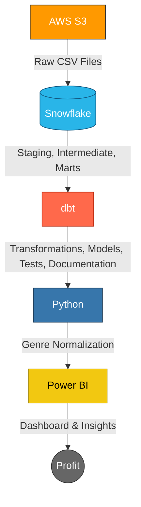

# Netflix Data Engineering Pipeline: AWS, Snowflake, dbt, Python, Power BI

## Overview
This project is an end-to-end cloud-based data engineering pipeline that extracts insights on the highest performing movies and genres by decade. The pipeline ingests raw data into AWS S3, loads it into Snowflake, transforms it using dbt, normalizes genres in Python, and visualizes insights through a PowerBI dashboard. This project demonstrates current data engineering practices including ELT modeling, cloud warehousing, data transformation, documentation, and analytics engineering.

## Data Visualization

### Example use case
Netflix is evaluating which genre to back for a new original film. Using the dashboard’s decade‑by‑decade projections and genre performance metrics, the action genre appears to be a strong candidate.
* Action generated $89.2 billion in the last two decades in this sample, outperforming the projection by $29.3 billion (about 148.9% above expectation based on all-genre decade-over-decade growth rate).
* Action represents the largest market share of total revenue across genres at 28.89%.
* The average profit for the 678 action films in the dataset is $102.8 million versus a baseline average of $42.8 million for all genres. This implies that action films deliver about 140% more profit on average.
* Historical data from the past two decades suggest that an average action film with a $67.1 million budget would deliver an ROI of 199.5%, generating roughly $200.8 million in revenue. By constrast, other genres averaged a $25.2 million budget with 152.5% ROI, so action presents a higher-risk, higher-reward opportunity.

**Recommendation:** If the goal is revenue maximization, then action is a strong candidate given its higher average profit and market share. To diversify outcomes, it is also a good idea to preserve a mix of lower risk genres.

## Data Architecture

This architecture implements an ELT pipeline ingesting raw CSV files into AWS S3, loading them into a Snowflake cloud data warehouse, applying repeatable transformations with dbt, normalizing data with Python, and delivering interactive analytics in Power BI.
* **AWS S3:** Cheap, durable way to store raw CSVs as a single source of truth that can be re-run downstream
* **Snowflake:** Cloud data warehouse that separates storage and compute for scalable queries. Snowflake provides great performance on analytics applications
* **dbt:** Built staging models, marts, and metrics (decade buckets, ratings, ROI)
* **Python**: Normalized genre strings and wrote enriched data back to Snowflake
* **Power BI:** Developed an interactive dashboard to present insights

## Contact
Please feel free to contact me if you have any questions at:
* **Email:** cstoerck@gmail.com
* **LinkedIn:** https://www.linkedin.com/in/CodyStoerck/
