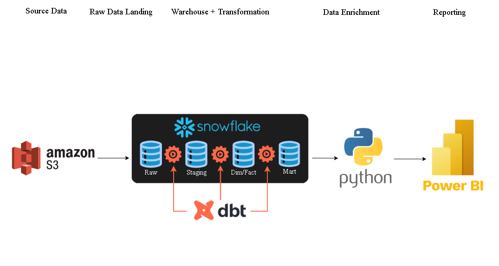
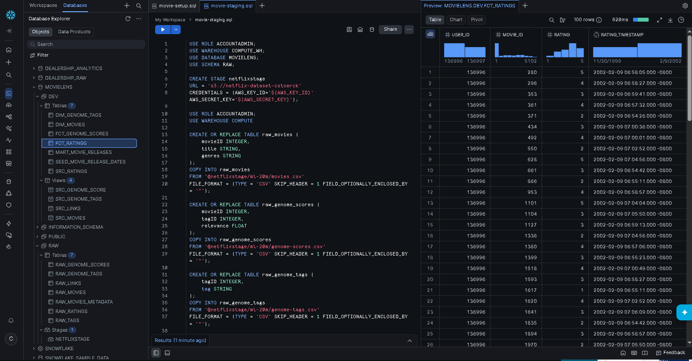
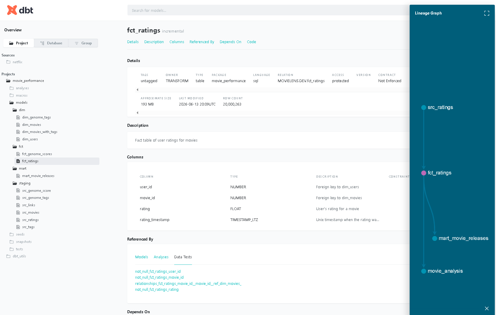
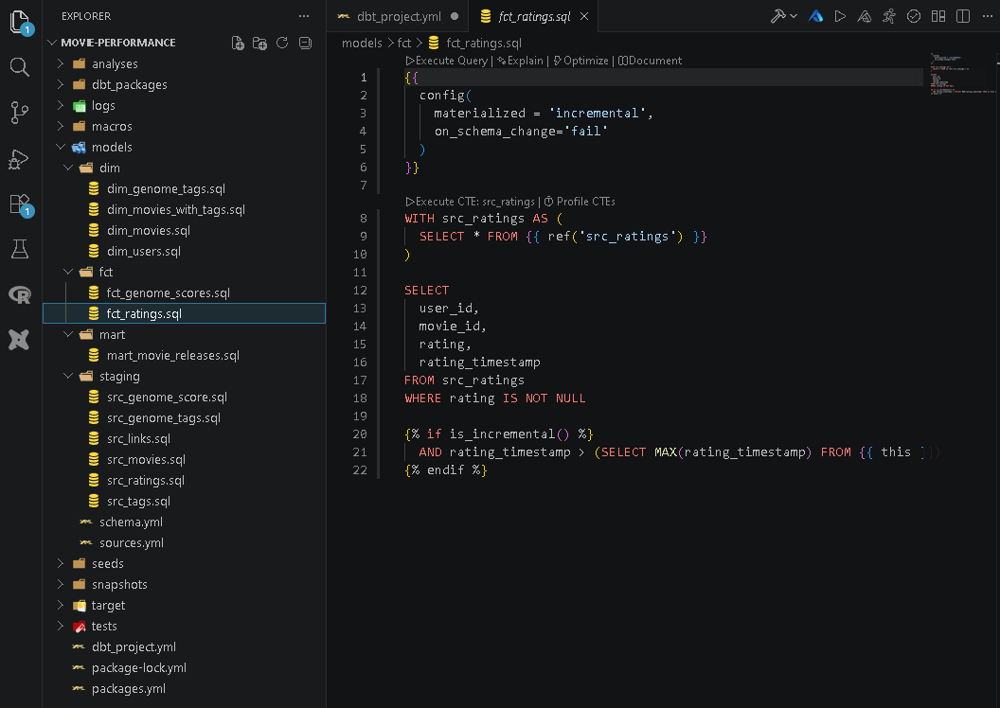
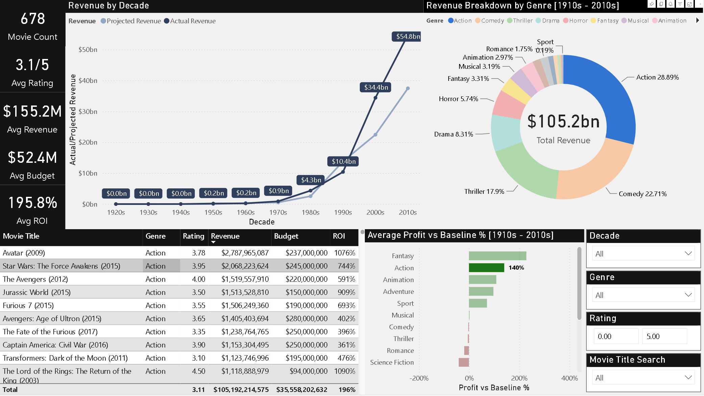

# Movie Performance Analytics Engineering Pipeline: AWS S3, Snowflake, dbt, Python, Power BI

## Live Power BI Dashboard
[View the Movie Performance Power BI Dashboard Here](https://app.powerbi.com/reportEmbed?reportId=176e7247-e1d8-49bd-a090-65fa77d7766f&autoAuth=true&ctid=c1a4ba1b-9903-4610-8c55-d0c4092d6598)

## Table of Contents
- [Overview](#overview)
- [Datasets](#datasets)
- [Tech Stack](#tech-stack)
- [Architecture Overview](#architecture-overview)
- [Business Problem](#business-problem)
- [Source Data and Raw Landing Layer](#source-data-and-raw-landing-layer)
- [Snowflake Warehouse Design](#snowflake-warehouse-design)
- [dbt Transformation Layer](#dbt-transformation-layer)
  - [dbt Project Configuration](#dbt-project-configuration)
  - [Source and Staging Layer](#source-and-staging-layer)
  - [Dimension and Fact Layer](#dimension-and-fact-layer)
  - [Mart Layer](#mart-layer)
  - [dbt Documentation and Lineage](#dbt-documentation-and-lineage)
- [Python Enrichment Layer](#python-enrichment-layer)
- [Power BI Reporting Layer](#power-bi-reporting-layer)
  - [Movie Performance Dashboard](#movie-performance-dashboard)
  - [Example Business Use Case](#example-business-use-case)
- [Setup Notes](#setup-notes)
- [Security and Credential Handling](#security-and-credential-handling)
- [Key Skills Demonstrated](#key-skills-demonstrated)
- [Project Summary](#project-summary)
- [Contact](#contact)

## Overview

Movie Performance is an end-to-end analytics engineering project that models how raw public movie datasets can be ingested, transformed, enriched, and delivered as business-ready reporting. Raw CSV files are staged in Amazon S3, loaded into Snowflake, transformed with dbt into source, dimension, fact, and mart models, enriched with Python-based genre logic, and visualized in Power BI.

This project was built to demonstrate how movie rating, genre, release, budget, and revenue data can be organized into a modern analytical workflow. The final reporting layer supports executive-style analysis around revenue trends, genre performance, movie ratings, return on investment, and decade-level movie performance.

---

## Datasets

This project uses public movie datasets as the source of raw CSV data.

- **The Movies Dataset — Rounak Banik:** Used for movie metadata, revenue, budget, release-date, and ROI-oriented modeling.  
  https://www.kaggle.com/datasets/rounakbanik/the-movies-dataset

- **MovieLens 20M Dataset — GroupLens:** Used for movie ratings, tags, genome scores, genome tags, links, and genre analysis.  
  https://www.kaggle.com/datasets/grouplens/movielens-20m-dataset

The original files are downloaded from Kaggle, placed in the configured S3 bucket path, loaded into Snowflake raw tables, and transformed downstream with dbt.

---

## Tech Stack

- **Raw file storage:** Amazon S3
- **Cloud data warehouse:** Snowflake
- **Transformation framework:** dbt
- **Data enrichment:** Python
- **Reporting layer:** Power BI
- **Source datasets:** Kaggle movie datasets and MovieLens-style CSV files
- **Development environment:** VS Code
- **Version control:** GitHub

---

## Architecture Overview

The Movie Performance pipeline follows a source-to-dashboard analytics workflow. Raw movie CSV files are stored in Amazon S3 and loaded into Snowflake through a Snowflake stage. Snowflake stores the raw files in a dedicated `RAW` schema. dbt reads from the raw source tables, standardizes fields in source/staging models, builds dimension and fact models, and creates a mart model for reporting. Python supports genre normalization and enrichment logic. Power BI connects to the curated Snowflake models to provide an interactive business-facing dashboard.

\
**Figure 1:** End-to-end architecture showing raw movie data moving from Amazon S3 into Snowflake, transformed with dbt across raw, staging, dimension/fact, and mart layers, enriched with Python, and consumed through Power BI.

### Data Flow

1. Public movie dataset CSV files are downloaded from Kaggle.
2. Raw CSV files are uploaded to an Amazon S3 bucket.
3. Snowflake loads the S3 files into raw landing tables through a configured stage.
4. dbt standardizes the raw source data into clean source/staging models.
5. dbt builds analytical dimension and fact tables for movies, users, ratings, genome tags, and genome scores.
6. dbt creates a mart model that enriches ratings with release-date availability logic.
7. Python supports genre ordering and normalization logic used for downstream analysis.
8. Power BI consumes the curated Snowflake models and presents movie performance insights.

---

## Business Problem

Streaming platforms, studios, and media analysts need visibility into which movies and genres perform best across time. Raw movie datasets contain useful rating, genre, revenue, budget, and tag information, but the data is spread across separate files and is not directly structured for business reporting.

This project models how raw movie data can be transformed into an analytics-ready warehouse that supports questions such as:

- Which genres generate the highest revenue across decades?
- How do actual revenues compare against projected revenue trends?
- Which genres outperform the baseline profit expectation?
- Which movies produce the highest revenue and ROI?
- How do movie ratings, budgets, revenues, and genre classifications interact?
- Which decades show the strongest revenue growth in the sample?

---

## Source Data and Raw Landing Layer

The source data is composed of MovieLens-style rating and tagging files along with external movie metadata. The raw files are stored in S3 and loaded into Snowflake through the `netflixstage` stage.

Raw files loaded into Snowflake include:

```text
movies.csv
genome-scores.csv
genome-tags.csv
links.csv
ratings.csv
tags.csv
movies_metadata.csv
```

Snowflake raw landing tables include:

```text
raw_movies
raw_genome_scores
raw_genome_tags
raw_links
raw_ratings
raw_tags
raw_movies_metadata
```

This raw landing design preserves source-level data before dbt applies transformations. Keeping raw data separate from transformed models makes the pipeline easier to audit, rebuild, and extend.

---

## Snowflake Warehouse Design

Snowflake serves as the central analytical warehouse for the project. The warehouse is organized into separate schemas so raw ingested data remains separate from dbt-built analytical models.

The Snowflake setup creates:

```text
MOVIELENS.RAW
MOVIELENS.DEV
```

The `RAW` schema stores source tables loaded from S3. The `DEV` schema stores dbt-generated models used for analytics and reporting.

The Snowflake setup also creates a transformation role and compute warehouse:

```text
Role: TRANSFORM
Warehouse: COMPUTE_WH
Database: MOVIELENS
Raw schema: RAW
Development/modeling schema: DEV
```

\
**Figure 2:** Snowflake warehouse view showing the `MOVIELENS` database with raw landing tables, dbt-built models in the development schema, and a preview of the `FCT_RATINGS` table.

---

## dbt Transformation Layer

The dbt project, `movie_performance`, transforms raw movie data in Snowflake into analytics-ready models. The project uses a layered modeling structure with source/staging models, dimension models, fact models, and a reporting mart.

### dbt Project Configuration

- Project name: `movie_performance`
- Profile name: `movie_performance`
- Model path: `models/`
- Analysis path: `analyses/`
- Test path: `tests/`
- Seed path: `seeds/`
- Macro path: `macros/`
- Snapshot path: `snapshots/`

The materialization strategy is intentional:

- **Default models** are materialized as views.
- **Dimension models** are materialized as tables.
- **Fact models** are materialized as tables unless overridden at the model level.
- **`fct_ratings`** is materialized as an incremental model to support scalable rating refreshes.

This design keeps lightweight source models easy to rebuild while persisting analytical tables used by downstream reporting.

### Source and Staging Layer

The dbt source layer defines the raw Snowflake objects under the `netflix` source and `raw` schema. Source tables include:

```text
r_movies
r_ratings
r_tags
r_genome_tags
r_genome_scores
r_links
```

Staging/source models standardize raw field names and prepare the data for downstream modeling.

Staging models include:

```text
src_movies
src_ratings
src_genome_score
src_genome_tags
src_links
src_tags
```

Examples of staging logic include:

- Renaming raw MovieLens fields such as `movieId` to `movie_id`.
- Converting raw rating timestamps into Snowflake timestamp values.
- Preserving source-level movie titles and genre strings for downstream cleaning.

### Dimension and Fact Layer

The dimension and fact layer organizes the movie data into analytics-ready entities and event tables.

Dimension models include:

```text
dim_movies
dim_movies_with_tags
dim_users
dim_genome_tags
```

The `dim_movies` model standardizes movie titles and converts pipe-delimited genre strings into an array-style genre field. This makes genre-based analysis easier in downstream models and reporting.

Fact models include:

```text
fct_ratings
fct_genome_scores
fct_movies_metadata
```

The `fct_ratings` model is configured as an incremental model. It references `src_ratings`, filters out null ratings, and only processes records with a `rating_timestamp` greater than the maximum timestamp already present in the target table during incremental runs.

This incremental design is useful for large rating datasets because it avoids rebuilding the full table every time new rating records are added.

The `fct_genome_scores` model supports analysis of movie-to-tag relevance scores, while `fct_movies_metadata` supports revenue, budget, release, and ROI-oriented reporting.

### Mart Layer

The mart layer contains reporting-ready models consumed by the dashboard.

Mart models include:

```text
mart_movie_releases
```

The `mart_movie_releases` model joins the ratings fact table with the seeded movie release-date data and adds a `release_info_available` flag. This makes release metadata availability explicit for downstream analysis.

### dbt Documentation and Lineage

The project includes dbt documentation and lineage artifacts to make the transformation workflow easier to inspect. dbt docs show how raw source models feed fact models and how downstream mart models depend on curated fact data.

\
**Figure 3:** dbt lineage view showing the dependency path from `src_ratings` into `fct_ratings` and downstream reporting models.

\
**Figure 4:** dbt model overview showing the project structure across staging, dimension, fact, and mart folders.

The project also includes supporting dbt assets such as seeds, snapshots, tests, and macros:

```text
seed_movie_release_dates.csv
snap_tags.sql
relevence_score_test.sql
no_nulls_in_columns.sql
```

These assets demonstrate dbt functionality beyond basic SQL model creation, including seed-based enrichment, snapshot tracking, reusable testing logic, and custom validation.

---

## Python Enrichment Layer

Python is used to support genre normalization and enrichment logic. The Python workflow uses pandas and a manually defined genre hierarchy to support consistent genre ordering across reporting outputs. The script also references the external movies dataset used for metadata enrichment.

The genre hierarchy includes categories such as:

```text
Documentary
Musical
Horror
Thriller
Action
Comedy
Drama
Romance
Crime
Mystery
Film-Noir
Western
Science Fiction
Fantasy
Adventure
War
History
Sport
Music
Animation
Children
```

This enrichment layer helps convert raw genre information into a more consistent analytical structure for dashboarding and comparison across genres.

---

## Power BI Reporting Layer

Power BI serves as the final consumption layer for the Movie Performance analytics pipeline. The dashboard connects to curated Snowflake data and presents business-facing insights around revenue, ratings, genre performance, budget, and ROI.

### Movie Performance Dashboard

The dashboard summarizes movie performance across high-level KPIs and supporting visuals.

The published Power BI dashboard can be viewed here:  
[Open the Movie Performance Power BI Dashboard](https://app.powerbi.com/reportEmbed?reportId=176e7247-e1d8-49bd-a090-65fa77d7766f&autoAuth=true&ctid=c1a4ba1b-9903-4610-8c55-d0c4092d6598)

\
**Figure 5:** Power BI dashboard showing movie count, average rating, average revenue, average budget, average ROI, revenue by decade, revenue breakdown by genre, movie-level revenue and ROI details, and interactive filters.

The dashboard includes:

- **KPI cards** for movie count, average rating, average revenue, average budget, and average ROI.
- **Revenue by decade** comparing projected revenue against actual revenue.
- **Revenue breakdown by genre** showing total revenue contribution by genre.
- **Movie-level detail table** showing title, genre, rating, revenue, budget, and ROI.
- **Average profit vs baseline percentage** comparing genre profitability against a baseline.
- **Interactive slicers** for decade, genre, rating range, and movie title search.

### Example Business Use Case

A streaming platform is evaluating which genre to prioritize for a new original film. Using the dashboard’s decade-by-decade revenue trends and genre performance metrics, the action genre appears to be a strong candidate in this sample.

Dashboard observations include:

- Action represents the largest visible share of total revenue at approximately `28.89%`.
- The dashboard shows total analyzed revenue of approximately `$105.2bn`.
- Action shows a positive profit-vs-baseline comparison of approximately `140%`.
- Recent decades show the strongest revenue growth, especially across the 1990s, 2000s, and 2010s.

**Recommendation:** If the business goal is revenue maximization, action is a strong candidate based on historical market share and profit performance in this dataset. However, a portfolio strategy should still balance higher-revenue genres with lower-risk genres to diversify outcomes.

---

## Setup Notes

This repository is intended as a portfolio demonstration of an end-to-end analytics engineering workflow. Running the full project requires local and cloud configuration across AWS S3, Snowflake, dbt, Python, and Power BI.

### High-Level Setup Flow

1. Download the required Kaggle datasets.
2. Upload the raw CSV files to the configured Amazon S3 bucket path.
3. Run `snowflake/setup.sql` to create the Snowflake role, warehouse, database, schemas, and dbt user.
4. Run `snowflake/staging.sql` to create the Snowflake stage, raw tables, and `COPY INTO` load commands.
5. Configure the dbt Snowflake profile for the `movie_performance` project.
6. Run dbt dependencies, seeds, models, tests, and docs generation.
7. Run the Python genre enrichment workflow if needed for local preprocessing or genre ordering.
8. Open the Power BI report and connect it to the curated Snowflake models.

### Snowflake Setup

Run the Snowflake setup script as a privileged Snowflake role:

```bash
snowsql -a <SNOWFLAKE_ACCOUNT> -u <ADMIN_USER> -r ACCOUNTADMIN -f snowflake/setup.sql
```

Then run the staging script after configuring the required S3 credential placeholders:

```bash
snowsql -a <SNOWFLAKE_ACCOUNT> -u <ADMIN_USER> -f snowflake/staging.sql
```

### dbt Setup

Create or update your dbt profile to point to Snowflake:

```yaml
movie_performance:
  target: dev
  outputs:
    dev:
      type: snowflake
      account: "<SNOWFLAKE_ACCOUNT>"
      user: "<SNOWFLAKE_USER>"
      password: "<SNOWFLAKE_PASSWORD>"
      role: TRANSFORM
      database: MOVIELENS
      warehouse: COMPUTE_WH
      schema: DEV
      threads: 4
```

Run dbt from the `dbt` directory:

```bash
cd dbt
dbt deps
dbt seed
dbt run
dbt test
dbt docs generate
dbt docs serve
```

### Power BI Setup

1. Open the Power BI report file from the `powerbi/` folder.
2. Connect Power BI to Snowflake.
3. Select the `MOVIELENS` database and `DEV` schema.
4. Refresh the semantic model after dbt models have been built.
5. Publish the dashboard to Power BI Service if needed.

### Required Configuration Values

The following values should be managed outside version control:

```text
AWS_KEY_ID
AWS_SECRET_KEY
SNOWFLAKE_ACCOUNT
SNOWFLAKE_USER
SNOWFLAKE_PASSWORD
SNOWFLAKE_ROLE
SNOWFLAKE_WAREHOUSE
SNOWFLAKE_DATABASE
SNOWFLAKE_SCHEMA
POWER_BI_WORKSPACE_ID
POWER_BI_DATASET_ID
```

---

## Security and Credential Handling

This project uses several tools that require credentials, including AWS, Snowflake, dbt, and Power BI. Public repositories should never expose real passwords, access keys, secret keys, account identifiers, private keys, or connection strings.

Recommended public repository practices:

- Replace real credentials with placeholders.
- Use `.env.example` files instead of committing real `.env` files.
- Store Snowflake, AWS, and Power BI credentials outside version control.
- Avoid hardcoding passwords in SQL setup scripts.
- Rotate any credentials that were ever committed publicly.
- Use environment variables or a secrets manager for deployment workflows.

---

## Key Skills Demonstrated

This project demonstrates practical analytics engineering and data engineering skills across the modern data stack:

- Cloud raw data storage with Amazon S3
- Snowflake database, schema, warehouse, role, and stage setup
- Bulk loading raw CSV data into Snowflake with `COPY INTO`
- dbt source modeling and layered transformations
- dbt dimension, fact, and mart model design
- Incremental dbt modeling for large rating data
- dbt documentation and lineage generation
- dbt seeds, snapshots, tests, and macros
- Python-based genre normalization and enrichment support
- Power BI dashboard design and business storytelling
- GitHub repository organization for portfolio presentation
- Credential hygiene and public repository security practices

---

## Project Summary

Movie Performance demonstrates how raw public movie datasets can be converted into a business-ready analytics product. The project begins with CSV files staged in Amazon S3, loads them into Snowflake, transforms them with dbt into analytical models, applies Python-supported genre enrichment logic, and visualizes the final results in Power BI.

The result is a complete analytics engineering portfolio project that shows how raw data can be ingested, modeled, documented, enriched, and delivered as interactive reporting for business decision-making.

## Contact

Please feel free to contact me at:

- **Email:** cstoerck@gmail.com
- **LinkedIn:** https://www.linkedin.com/in/CodyStoerck/
