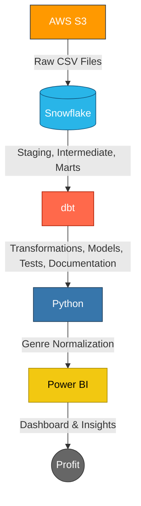

# Netflix Data Engineering Pipeline: AWS, Snowflake, dbt, Python, Power BI

## Overview
This project is an end-to-end cloud-based data engineering pipeline and dashboard that extracts insights on the highest performing movies and genres by decade. The pipeline ingests raw data into AWS S3, loads it into Snowflake, transforms it using dbt, normalizes genres in Python, and visualizes insights through a Power BI dashboard. This project demonstrates current data engineering practices including ELT modeling, cloud warehousing, data transformation, documentation, and analytics engineering.

## Datasets
This project uses two public Kaggle movie datasets as the source of raw CSVs. Download the originals and place the files in your S3 bucket (or follow your preferred ingestion process) before running the pipeline.
* **The Movies Dataset (Rounak Banik)** — used for revenue and ROI modeling 
  https://www.kaggle.com/datasets/rounakbanik/the-movies-dataset
* **MovieLens 20M Dataset (GroupLens)** — used for ratings and genre analysis and enrichment  
  https://www.kaggle.com/datasets/grouplens/movielens-20m-dataset

## Data Visualization

### Example use case
Netflix is evaluating which genre to back for a new original film. Using the dashboard’s decade‑by‑decade projections and genre performance metrics, the action genre appears to be a strong candidate.
* Action generated $89.2 billion in the last two decades in this sample, outperforming the projection by $29.3 billion (about 148.9% above expectation based on all-genre decade-over-decade growth rate).
* Action represents the largest market share of total revenue across genres at 28.89%.
* The average profit for the 678 action films in the dataset is $102.8 million versus a baseline average of $42.8 million for all genres. This implies that action films deliver about 140% more profit on average.
* Historical data from the past two decades suggest that an average action film with a $67.1 million budget would deliver an ROI of 199.5%, generating roughly $200.8 million in revenue. By constrast, other genres averaged a $25.2 million budget with 152.5% ROI, so action presents a higher-risk, higher-reward opportunity.

**Recommendation:** If the goal is revenue maximization, then action is a strong candidate given its higher average profit and market share. To diversify outcomes, it is also a good idea to preserve a mix of lower risk genres.

## Data Architecture

```mermaid
graph TD
    %% Nodes
    S3[AWS S3]
    SF[(Snowflake)]
    DBT[dbt]
    PY[Python]
    PBI[Power BI]

    %% Flow with Labels
    S3 -- "Raw CSV Files" --> SF
    SF -- "Staging, Intermediate, Marts" --> DBT
    DBT -- "Transformations, Models, Tests, Documentation" --> PY
    PY -- "Genre Normalization" --> PBI
    PBI -- "Dashboard & Insights" --> Finish((Profit))

    %% Styling
    style S3 fill:#FF9900,stroke:#232F3E,color:#fff
    style SF fill:#29B5E8,stroke:#11567F,color:#fff
    style DBT fill:#FF694B,stroke:#ad1c00,color:#fff
    style PY fill:#3776AB,stroke:#1e3d59,color:#fff
    style PBI fill:#F2C811,stroke:#a68900,color:#000
    style Finish fill:#666,stroke:#333,color:#fff
```
This architecture implements an ELT pipeline ingesting raw CSV files into AWS S3, loading them into a Snowflake cloud data warehouse, applying repeatable transformations with dbt, normalizing data with Python, and delivering interactive analytics in Power BI.
* **AWS S3:** Cheap, durable way to store raw CSVs as a single source of truth that can be re-run downstream
* **Snowflake:** Cloud data warehouse that separates storage and compute for scalable queries. Snowflake provides great performance on analytics applications
* **dbt:** Built staging models, marts, and metrics (decade buckets, ratings, ROI)
* **Python**: Normalized genre strings and wrote enriched data back to Snowflake
* **Power BI:** Developed an interactive dashboard to present insights

## How to run

To run the pipeline end‑to‑end: provision Snowflake, load raw CSVs from S3, run dbt transforms, normalize genres with Python, and open the Power BI dashboard.

### Prerequisites
- **Accounts / tools:** Snowflake (admin role for setup), AWS S3, dbt (v1.x) with `dbt-snowflake`, Python 3.8+, Power BI Desktop.  
- **Data:** Download the two Kaggle datasets listed in **Datasets** and upload the CSVs to your S3 bucket in the paths referenced by `snowflake/staging.sql`.  
- **Secrets:** Provide credentials via environment variables or CI secrets. Typical variables: `AWS_KEY_ID`, `AWS_SECRET_KEY`, `SNOWFLAKE_ACCOUNT`, `SNOWFLAKE_USER`, `SNOWFLAKE_PASSWORD`.

### 1. Create Snowflake objects
Run the Snowflake setup script to create role, warehouse, database, schemas, and the `dbt` user. Run as a privileged role (for example `ACCOUNTADMIN`):

```bash
snowsql -a <ACCOUNT> -u <ADMIN_USER> -r ACCOUNTADMIN -f snowflake/setup.sql
```

### 2. Load raw CSVs into Snowflake
Ensure your S3 bucket matches the paths referenced in `snowflake/staging.sql`

Set credentials in your shell (example):

```bash
export AWS_KEY_ID="..."
export AWS_SECRET_KEY="..."
export SNOWFLAKE_ACCOUNT="..."
export SNOWFLAKE_USER="<ADMIN_USER>"
```

Run the staging script:

```bash
snowsql -a $SNOWFLAKE_ACCOUNT -u $SNOWFLAKE_USER -f snowflake/staging.sql
```

Verify a few row counts in Snowflake:

```sql
USE DATABASE MOVIELENS;
USE SCHEMA RAW;
SELECT COUNT(*) FROM raw_movies;
SELECT COUNT(*) FROM raw_ratings;
```


### 3. Configure dbt (project specifics)
Create or update your dbt profile (`~/.dbt/profiles.yml`) to match the `netflix` profile and point to Snowflake `MOVIELENS` / schema `DEV`. Example:

```yaml
netflix:
  target: dev
  outputs:
    dev:
      type: snowflake
      account: "<SNOWFLAKE_ACCOUNT>"
      user: "<SNOWFLAKE_USER>"
      password: "<SNOWFLAKE_PASSWORD>"
      role: TRANSFORM
      database: MOVIELENS
      warehouse: COMPUTE_WH
      schema: DEV
      threads: 4
```

#### Run dbt

```bash
cd dbt
dbt deps
dbt seed
dbt run
dbt test
dbt docs generate
```

Run specific models as needed:

```bash
dbt run --models <model_name>
```

**Notes**
- Use `dbt debug` to validate the profile and connection if you encounter issues.

### 4. Normalize genres with Python
Create a virtual environment, install dependencies, and run the genre parsing script to write normalized/enriched tables back to `MOVIELENS.DEV`.

### 5. Power BI dashboard
- In Power BI Desktop: **Get Data → Snowflake**. Connect to **MOVIELENS / DEV** using a read account.  
- Import the views and create visualizations.

## Contact
Please feel free to contact me if you have any questions at:
* **Email:** cstoerck@gmail.com
* **LinkedIn:** https://www.linkedin.com/in/CodyStoerck/
